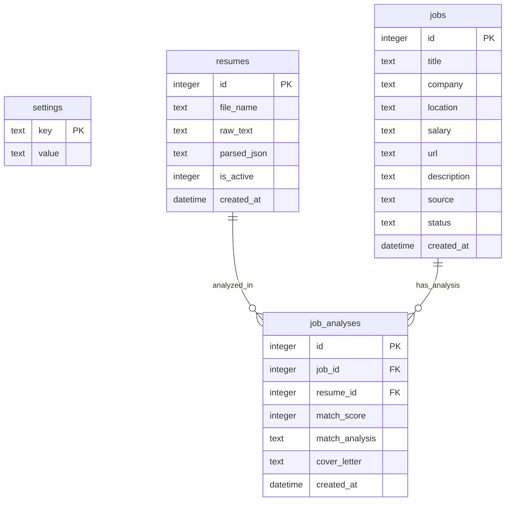

# GetaJob - AI 智慧求職與客製化求職信助手：專案大綱

本專案旨在開發一個本機運行的 Web 應用程式，結合網頁爬蟲、Chrome 擴充功能 (Chrome Extension) 與 Gemini AI，協助求職者高效管理職缺、分析履歷契合度，並生成量身打造的求職信 (Cover Letter)。

---

## 1. 系統架構圖 (Architecture Overview)

### 1.1 System Architecture Diagram

```mermaid
graph TD
    User([User]) -->|Interacts / Uploads Resume| WebUI[Next.js React Frontend]
    ChromeExtension[Chrome Extension Content & Popup] -->|Scrapes DOM / Sends Payload| API_Extension[pages/api/scrape/extension.js]
    
    subgraph Local Next.js Backend (Node.js)
        API_Jobs[pages/api/db/jobs.js]
        API_Settings[pages/api/settings.js]
        API_Parser[pages/api/ai/parse-resume.js]
        API_Analyze[pages/api/ai/analyze-job.js]
        API_Letter[pages/api/ai/generate-cover-letter.js]
        
        ScraperEngine{Scraper Router}
        AxiosScraper[Axios/Cheerio Scraper]
        PuppeteerScraper[Puppeteer Headless Scraper]
    end

    SQLite[(\.getajob\getajob.db)]

    WebUI --> API_Jobs
    WebUI --> API_Settings
    WebUI --> API_Parser
    WebUI --> API_Analyze
    WebUI --> API_Letter
    
    API_Extension --> SQLite
    API_Jobs --> SQLite
    API_Settings --> SQLite
    API_Parser --> SQLite
    API_Analyze --> SQLite
    API_Letter --> SQLite

    API_Jobs --> ScraperEngine
    ScraperEngine -->|Static Site e.g. 104| AxiosScraper
    ScraperEngine -->|SPA / Dynamic e.g. CakeResume| PuppeteerScraper

    API_Parser -->|SDK: Structured Output| Gemini[Gemini API]
    API_Analyze --> Gemini
    API_Letter --> Gemini
```

### 1.2 Database Schema Diagram



---

## 2. 功能模組設計 (Core Modules)

### 2.1 履歷導入與 AI 解析 (PDF Upload, @google/genai SDK & responseSchema)
- **免複製無縫導入**：提供**拖曳上傳 PDF 履歷**功能。系統自動讀取上傳的 PDF 檔案並解析出純文字（使用 `pdf-parse` 等套件），完全避免手動複製貼上履歷內容的繁瑣操作。
- **AI 結構化輸出**：採用最新的 `@google/genai` SDK，並使用 `generationConfig` 中的 `responseSchema` 屬性來定義嚴格的 JSON Schema 結構（包括姓名、聯絡資訊、教育背景、工作經歷、技能等），確保 Gemini API 回傳的 JSON 格式 100% 符合預期，避免手動解析字串出錯。
- **多履歷支援**：使用者可上傳多份履歷，並能設定當前選用的履歷，每份履歷與職缺的契合度分析各自獨立儲存。

### 2.2 彈性區域與平台設定 (Flexible Settings, Chrome Extension & Hybrid Crawler)
- **一鍵式區域與平台設定**：使用者可在 UI 設定頁面中以簡易開關或下拉選單，隨時切換**目標求職地區（例如：台灣 Taiwan、美國 US）**與**目標求職平台（例如：104、CakeResume、LinkedIn、Indeed）**。
- **爬蟲與擴充功能協同尊重**：
  - Chrome 擴充功能與後端爬蟲路由會讀取並尊重此設定，自動過濾、適配或優化對應平台的 DOM 結構解析演算法。
- **Axios & Puppeteer 混合爬蟲**：
  - 本機後端提供職缺爬蟲路由服務。根據不同的目標網站特性，自動切換爬蟲引擎：
    - **Axios + Cheerio 靜態爬蟲**：針對靜態渲染、速度要求高的網站（例如 104），直接使用 Axios 發送 HTTP GET 請求取得網頁 HTML，再以 Cheerio 解析 DOM。
    - **Puppeteer 動態爬蟲**：針對 SPA 框架（如 CakeResume、Indeed、LinkedIn）或防爬蟲機制較嚴格的網站，啟動無頭瀏覽器 (Headless Puppeteer) 渲染 JavaScript，模擬真實使用者行為後再進行內容解析。

### 2.3 職缺契合度分析與多履歷連結 (`job_analyses`)
- **分析內容**：比對求職者所選之履歷與職缺要求的技能、經驗。
- **資料庫解耦**：為了支援「一份職缺可對照多份履歷分析」的情境，將契合度分數、強勢/劣勢分析以及客製化求職信欄位從 `jobs` 表中移除，改儲存於全新的關聯資料表 `job_analyses` 中。
- **輸出指標**：契合度評分 (0-100%)、優勢 (Matches)、待補足技能/劣勢 (Gaps)。

### 2.4 AI 客製化 Cover Letter 生成與免受額度限制優化 (Gemini Free Tier Optimization)
- **免費額度優化 (No Generation Constraints)**：為了讓使用者能在 Gemini API 免費方案下順暢使用，不因頻繁請求而遭到限制（Rate Limit），後端實作以下優化策略：
  1. **指數型退避與自動重試 (Exponential Backoff with Jitter)**：當呼叫 API 遇到 `429 Too Many Requests` 時，會自動進行間隔重試。
  2. **智慧型快取 (Smart Caching)**：相同履歷與職缺的分析與求職信生成，優先讀取 `job_analyses` 資料庫中的快取，避免重複呼叫消耗額度。
  3. **請求令牌桶控制 (Token Bucket Rate Limiter)**：於後端限制請求速率（如每分鐘最多 15 次），以配合 Gemini API 免費等級之限制（15 RPM）。
- **智慧生成**：結合特定履歷優勢與職缺描述，撰寫精準、專業的求職信。
- **儲存與編輯**：生成後的 Cover Letter 與對應 `job_id` 及 `resume_id` 綁定儲存於 `job_analyses` 資料表中，前端提供 Markdown 編輯器供使用者線上微調。

### 2.5 求職看板 (Kanban)
- **狀態管理**：包含「感興趣 (Interested)」、「已投遞 (Applied)」、「面試中 (Interviewing)」、「已錄取 (Offered)」、「不考慮/婉拒 (Rejected)」。

---

## 3. 資料庫結構設計 (Database Schema)

本地 SQLite 資料庫檔案統一重新導向至使用者家目錄的隱藏資料夾下，預設路徑為：`~/.getajob/getajob.db`。系統啟動時若發現該路徑或目錄不存在，會自動遞迴建立。

### 3.1 `settings` (系統設定)
- `key` (TEXT PK): 設定名稱（新增例如 `gemini_api_key`, `target_region`, `target_platforms` 儲存 JSON/逗號分隔字串）
- `value` (TEXT): 設定值

### 3.2 `resumes` (履歷資料)
- `id` (INTEGER PK AUTOINCREMENT)
- `file_name` (TEXT): 履歷原始檔名
- `raw_text` (TEXT): 履歷純文字內容
- `parsed_json` (TEXT): 解析後的結構化 JSON（包含姓名、聯絡方式、學歷、經歷、技能）
- `is_active` (INTEGER default 0): 是否為當前選用履歷 (1 代表是, 0 代表否)
- `created_at` (DATETIME default current_timestamp): 建立時間

### 3.3 `jobs` (職缺資料)
- `id` (INTEGER PK AUTOINCREMENT)
- `title` (TEXT): 職缺名稱
- `company` (TEXT): 公司名稱
- `location` (TEXT): 工作地區
- `salary` (TEXT): 薪資待遇
- `url` (TEXT): 職缺連結
- `description` (TEXT): 工作描述
- `source` (TEXT): 來源平台 (104, CakeResume, LinkedIn, Indeed, Manual)
- `status` (TEXT default 'Interested'): 目前狀態 (Interested, Applied, Interviewing, Offered, Rejected)
- `created_at` (DATETIME default current_timestamp): 建立時間

### 3.4 `job_analyses` (職缺分析與求職信資料)
- `id` (INTEGER PK AUTOINCREMENT)
- `job_id` (INTEGER FK -> `jobs.id` ON DELETE CASCADE): 職缺 ID
- `resume_id` (INTEGER FK -> `resumes.id` ON DELETE CASCADE): 履歷 ID
- `match_score` (INTEGER): 契合度評分 (0-100)
- `match_analysis` (TEXT): 契合度優勢與劣勢分析 (JSON 或 Markdown 格式)
- `cover_letter` (TEXT): 已生成的客製化求職信內容
- `created_at` (DATETIME default current_timestamp): 建立時間

---

## 4. API 端點規劃 (API Endpoints)

| 端點 | 方法 | 功能說明 |
| :--- | :--- | :--- |
| `/api/settings` | GET / POST | 讀取與更新設定（如 Gemini 金鑰、當前 `target_region` 與 `target_platforms`） |
| `/api/resumes` | GET / POST / DELETE | 讀取、上傳與刪除履歷（POST 支援 `multipart/form-data` 接收 PDF 檔案並自動觸發解析） |
| `/api/resumes/parse` | POST | 呼叫 Gemini 解析特定履歷並結構化 |
| `/api/jobs` | GET / POST / PUT / DELETE | 職缺的增刪查改與狀態更新 |
| `/api/scrape/extension` | POST | 接收 Chrome 擴充功能傳回的職缺資料，回傳 `{ success: true, jobId }` |
| `/api/ai/analyze-job` | POST | 傳入 `{ jobId, resumeId }`，呼叫 Gemini 進行契合度分析，更新 `job_analyses` 表，並回傳 `{ match_score, match_analysis }` |
| `/api/ai/generate-cover-letter` | POST | 傳入 `{ jobId, resumeId }`，呼叫 Gemini 生成求職信，更新 `job_analyses` 表，並回傳 `{ cover_letter }` |

### 4.1 CORS 與安全設定 (Chrome Extension 跨域)
- API 端點（尤其是 `/api/scrape/extension`）需設定 `Access-Control-Allow-Origin` 標頭，允許來自 Chrome 擴充功能 ID (`chrome-extension://<id>`) 的跨域請求，並妥善處理 Preflight OPTIONS 請求。

---

## 5. UI Glassmorphism 視覺風格與前端架構

### 5.1 Glassmorphism 變數與樣式設計
本專案前端採用 Vanilla CSS 與 CSS Modules 實作毛玻璃風格 (Glassmorphism) 暗色主題，提供具備未來感的精緻介面。

#### 全局 CSS 變數定義 (例如 `styles/variables.css`)
```css
:root {
  --bg-dark: #0f111a;
  --glass-bg: rgba(255, 255, 255, 0.05);
  --glass-border: rgba(255, 255, 255, 0.1);
  --glass-shadow: 0 8px 32px 0 rgba(0, 0, 0, 0.37);
  --glass-blur: blur(12px);
  --text-primary: #f8fafc;
  --text-secondary: #94a3b8;
  --accent-color: #6366f1;
}
```

#### 毛玻璃卡片 CSS 類別
```css
.glass-card {
  background: var(--glass-bg);
  backdrop-filter: var(--glass-blur);
  -webkit-backdrop-filter: var(--glass-blur);
  border: 1px solid var(--glass-border);
  box-shadow: var(--glass-shadow);
  border-radius: 12px;
  color: var(--text-primary);
}
```

### 5.2 狀態管理 (Kanban Board State)
- 使用 React Client State 或 Context Provider (`JobContext`) 全局管理職缺狀態與設定狀態（例如區域/平台喜好）。
- 職缺拖移狀態更新時，採用 **樂觀更新 (Optimistic Updates)** 策略：前端畫面立即可視化移動卡片，並同步異步發送 `PUT /api/jobs` 更新請求；若 API 更新失敗，則將卡片退回原欄位並顯示錯誤提示。

### 5.3 UI 元件階層 (Component Hierarchy)
- `Layout`: 暗色毛玻璃包裝容器，包含左側導覽列。
- `Dashboard (Kanban Board)`: 看板主畫面，由水平彈性網格 (Flex Grid) 組成。
  - `KanbanColumn`: 看板欄位容器，列出所有處於特定狀態的職缺卡片。
    - `KanbanCard`: 職缺卡片。顯示職稱、公司、薪資、來源、以及與當前選用履歷的契合度分數標籤 (Match Score Badge)。
- `SettingsPanel`: 提供可視化的 Gemini API 金鑰輸入框、API 免費額度流量狀態指示、求職目標地區切換開關、目標求職平台開關（104、CakeResume、LinkedIn、Indeed 等）。
- `ResumeManager`: 履歷管理介面。支援 PDF 拖曳上傳 (Drag and Drop PDF Upload) 及切換當前選用 (Active) 履歷。
- `AnalysisModal`: 詳細分析彈窗。顯示 AI 分析之優勢與劣勢列表，並整合 Markdown 格式的 Cover Letter 編輯與複製器。

---

## 6. 使用者流程與角色特定細節 (Product Manager & User Flow)

### 6.1 使用者引導流程 (Onboarding Flow)
1. **步驟一**：使用者啟動本機 GetaJob Web 應用程式。後端檢查資料庫，若 `~/.getajob/getajob.db` 不存在，則自動建立並執行 Schema 初始化。
2. **步驟二**：進入系統後，導引使用者至設定頁面輸入 Gemini API 金鑰，儲存至 `settings` 資料表。
3. **步驟三**：引導使用者在設定頁面挑選偏好的**目標求職地區（如：台灣、美國）**與**偏好平台**，此設定會同步影響後續的爬取對象和規則。
4. **步驟四**：引導使用者**拖曳上傳 PDF 履歷**，系統會透過後端 PDF 解析器自動提取文字並呼叫 Gemini API 結構化解析，在資料庫的 `resumes` 資料表中寫入記錄，預設將該履歷標記為作用中 (`is_active = 1`)。
5. **步驟五**：顯示 Chrome 擴充功能安裝指南，引導使用者將本機的 Extension 目錄（內含 `manifest.json`, `content.js`, `popup.html`, `popup.js`）以「開發者模式」載入至 Chrome 瀏覽器。

### 6.2 核心操作流程 (Job Clipping & Analysis Flow)
1. **步驟一**：使用者在瀏覽 LinkedIn、104、Indeed 或 CakeResume 職缺網頁時，點擊 Chrome 擴充功能。擴充功能會自動辨識該網站是否在使用者設定啟用之平台清單中。
2. **步驟二**：擴充功能的 content script 抓取目前職缺網頁的 DOM 資訊，經由 background worker 發送 JSON 數據到 Next.js API `/api/scrape/extension`。
3. **步驟三**：本機後端儲存職缺至 `jobs` 資料表中，使用者回到 GetaJob 看板即可在「感興趣 (Interested)」欄位看到剛剪輯的職缺卡片。
4. **步驟四**：使用者在看板中選擇特定履歷，並對該職缺點擊「Analyze Fit」。
5. **步驟五**：後端呼叫 `@google/genai` 結構化輸出 API 計算契合度，為配合 Gemini API 免費方案，執行速限佇列管理以防 API 呼叫失敗，將結果寫入 `job_analyses` 資料表。
6. **步驟六**：使用者點擊生成求職信，系統調用 Gemini 撰寫客製化 Cover Letter 並儲存於 `job_analyses` 中，使用者可直接在 Web 介面微調並複製。

---

## 7. 品質保證矩陣 (QA Verification Matrix)

### 7.1 API 整合測試 (API Integration Testing)
- 驗證 `/api/scrape/extension` 能正確接收 Chrome 擴充功能發送的 JSON 資料，且成功新增職缺時回傳 `201 Created`。
- 驗證當 API 接收到的 JSON 漏失關鍵欄位（如 `title` 或 `company`）時，能正確返回 `400 Bad Request` 與錯誤提示。
- 驗證 `/api/resumes` (POST) 接收 PDF 檔案上傳時，能成功解析 PDF 內容文字，無須手動貼上。

### 7.2 設定與區域切換測試 (Settings and Target Region Verification)
- 驗證在設定頁面切換為不同目標地區（台灣、美國等）與求職平台後，擴充功能與後端混合爬蟲的載入與分析行為是否會自動相應切換，並順利解析 Indeed、LinkedIn、104 等不同平台的 DOM 結構。
- 驗證 `settings` 資料表中對應之地區與平台欄位能即時寫入及更新。

### 7.3 資料庫持久化測試 (Database Persistence Verification)
- 驗證系統重啟後 SQLite 是否能正確讀取 `~/.getajob/getajob.db` 檔案，且資料不會遺失或損毀。
- 模擬寫入過程中發生異常中斷，確保 SQLite 交易 (Transaction) 能正常回滾 (Rollback)。

### 7.4 Chrome 擴充功能端到端測試 (Chrome Extension E2E Flow)
- 在模擬的 104、LinkedIn 和 CakeResume 測試網頁上執行擴充功能的 content script，確認即使網頁部分欄位（如薪資或地點）缺失，DOM 選擇器亦不會崩潰。
- 測試擴充功能與 localhost API 之間跨網域 (CORS) 連線的暢通性與 Preflight OPTIONS 的正確回覆。

### 7.5 AI 輸出結構符合性與免費限額保護測試 (AI Schema Compliance & Rate Limiting Verification)
- 傳送多組測試履歷與職缺給 `@google/genai` 解析器，驗證返回結果是否 100% 符合 JSON Schema 規定（例如：契合度分數 `match_score` 必須為 0 至 100 之間的整數）。
- **免費限額重試驗證**：模擬 Gemini API 回傳 `429 Too Many Requests`，驗證後端是否能自動執行指數型退避與重新嘗試，且連續生成多份 Cover Letter 時，請求速限器 (Rate Limiter) 有效保障呼叫額度，不使系統中斷或回傳 API 呼叫失敗。
